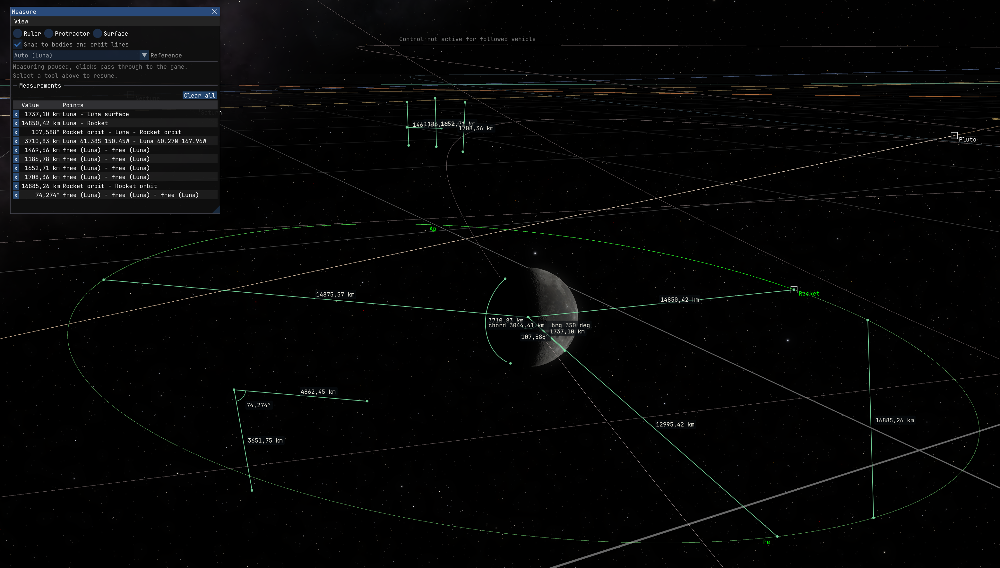

# MeasureTools [](https://opensource.org/licenses/MIT)

Click-to-measure ruler and protractor tools for [Kitten Space Agency](https://ahwoo.com/app/100000/kitten-space-agency).

This mod is written against the [StarMap loader](https://github.com/StarMapLoader/StarMap).



## Features

- **Ruler** - click two points in the map view to measure the straight-line distance.
  Snaps to bodies, to body surfaces (the edge of a planet's disc), and to points on
  orbit lines; clicks on empty space place free points.
- **Protractor** - click three points (arm, apex, arm) to read the true 3D angle plus
  both arm lengths, e.g. the phase angle between two planets around their star.
- **Surface** - pin two points to a planet's surface for the great-circle distance,
  chord, and initial bearing; pins track the body's rotation like ground markers.
- **Live preview** with snap highlighting, hover-sync between the list and the map,
  and click-to-copy values.

Planned: measuring in the vehicle editor, waiting for the upcoming editor rework
([#1](https://github.com/Maximilian-Nesslauer/KSA-MeasureTools/issues/1)).

## Usage

In the map view, open **View -> Measure**, pick a tool (Ruler, Protractor, Surface)
and click in the map to place points.

| Input | Action |
| --- | --- |
| Left-click | Place a point (snaps to bodies, disc edges, and orbit lines) |
| Ctrl + left-click | Place a free point on the ecliptic plane through the reference body |
| Short right-click | Cancel the current point, or pause measuring when nothing is pending |
| Click a list row | Copy the measurement to the clipboard |

Free clicks that snap to nothing land on the camera-facing plane. While measuring is
paused, no tool is selected and all clicks pass through to the game; pick a tool to
resume. Measurements are not saved to the save file; closing the window clears them.

## Installation

1. Install [StarMap](https://github.com/StarMapLoader/StarMap).
2. Download the latest release from the [GitHub Releases](https://github.com/Maximilian-Nesslauer/KSA-MeasureTools/releases) tab or from [SpaceDock](https://spacedock.info/mod/4319/MeasureTools).
3. Extract into `Documents\My Games\Kitten Space Agency\mods\MeasureTools\`.
4. The game auto-discovers new mods and prompts you to enable them. Alternatively, add to `Documents\My Games\Kitten Space Agency\manifest.toml`:

```toml
[[mods]]
id = "MeasureTools"
enabled = true
```

## Dependencies

| Package | Purpose | Tested version |
| --- | --- | --- |
| [StarMap](https://github.com/StarMapLoader/StarMap) | Mod loader, required at runtime (see [Installation](#installation)) | 0.4.5 |

## Build dependencies

Required only to build the mod from source. Targets **.NET 10**.

| Package | Source | Tested Version |
| --- | --- | --- |
| [StarMap.API](https://github.com/StarMapLoader/StarMap) | NuGet | 0.3.6 |
| [Lib.Harmony](https://www.nuget.org/packages/Lib.Harmony) | NuGet | 2.4.2 |

## Mod compatibility

- Known conflicts: none

## Community

Thread on the KSA forums: TBD

## Check out my other mods

- [AdvancedFlightComputer](https://github.com/Maximilian-Nesslauer/KSA-AdvancedFlightComputer) - Transfer Planner quick-tools (set Pe/Ap, match/set inclination, circularize), multi-pass burn splitting, and hyperbolic-target support (Oumuamua, 2I/Borisov, 3I/ATLAS) ([forum thread](https://forums.ahwoo.com/threads/advanced-flight-computer.783/))
- [AutoRemoveFinishedBurns](https://github.com/Maximilian-Nesslauer/KSA-AutoRemoveFinishedBurns) - automatically removes finished auto-burns from the burn plan ([forum thread](https://forums.ahwoo.com/threads/autoremovefinishedburns.928/))
- [AutoStage](https://github.com/Maximilian-Nesslauer/KSA-AutoStage) - automatic staging during auto-burns and manual flight, with configurable ignition delays ([forum thread](https://forums.ahwoo.com/threads/autostage.891/))
- [DeltaVMap](https://github.com/Maximilian-Nesslauer/KSA-DeltaVMap) - interactive delta-v subway map and transfer-window planner, auto-generated from the loaded system ([forum thread](https://forums.ahwoo.com/threads/deltavmap.978/))
- [StageInfo](https://github.com/Maximilian-Nesslauer/KSA-StageInfo) - extra info in the stock Stage/Sequence window: per-stage delta V, TWR, burn time, fuel pool, RCS, and more ([forum thread](https://forums.ahwoo.com/threads/stageinfo.905/))
